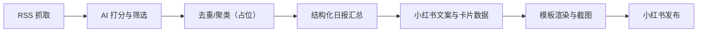
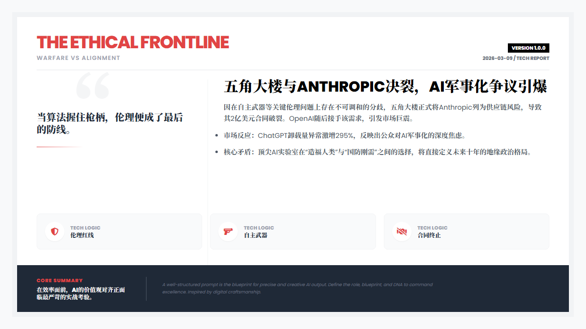
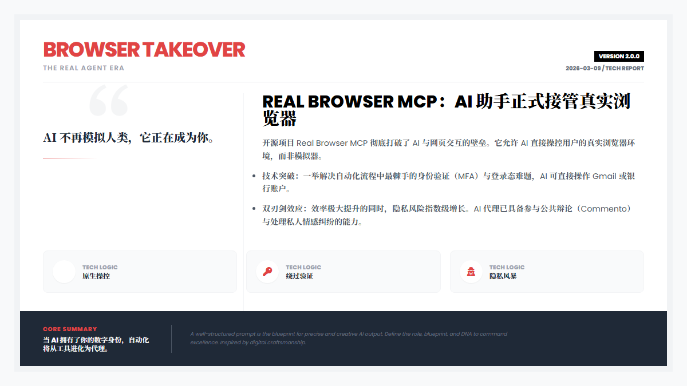
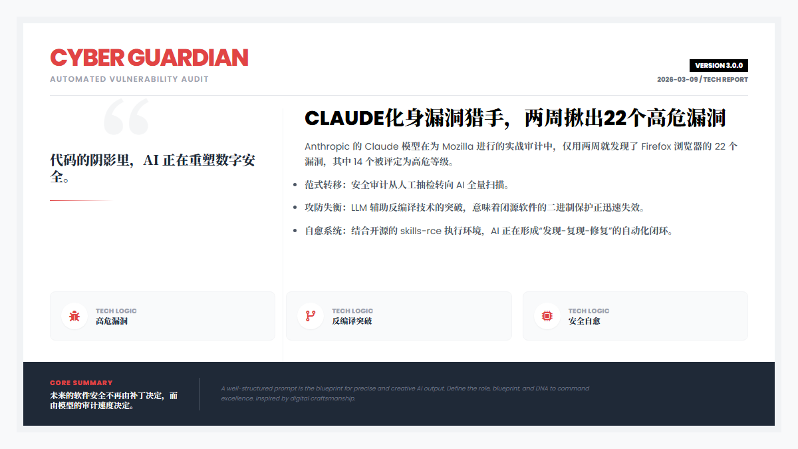
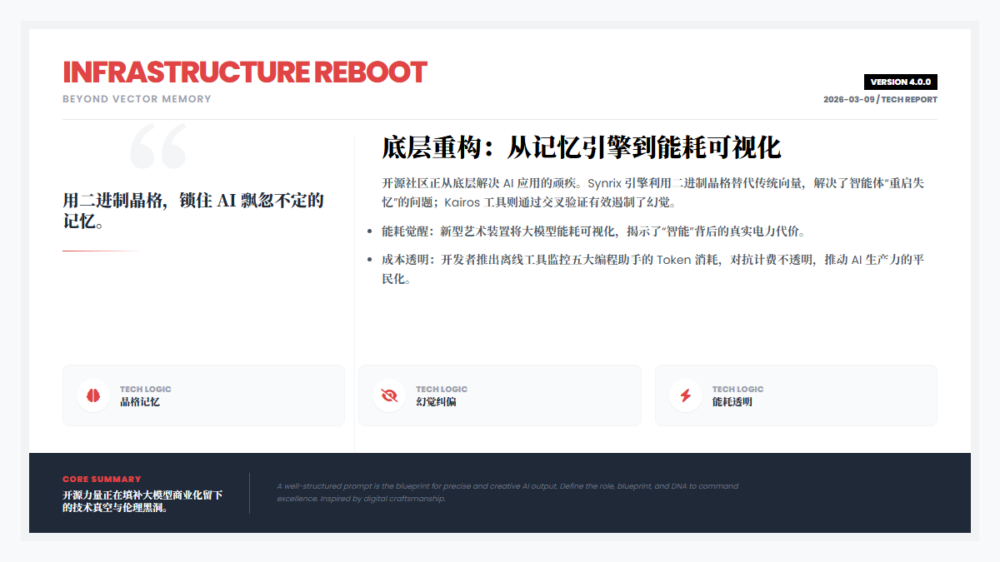

# AI 资讯日报智能体（RSS ➜ 摘要 ➜ 小红书图文发布）

面向 AI 资讯内容生产的一站式自动化流水线：从多源 RSS 抓取、智能打分筛选、结构化日报汇总，到生成小红书爆款文案与杂志风格卡片图，最终支持自动发布。

**适合场景**：AI 资讯号内容运营、每日行业情报、知识卡片生产、小红书图文矩阵。

## 功能亮点
- 多源 RSS 聚合与时效过滤
- DeepSeek-V3 智能打分与精品筛选
- Map-Reduce 结构化日报生成
- Gemini 生成小红书文案与杂志卡片数据
- Playwright 渲染 HTML 模板，批量输出成图
- MCP 驱动的一键自动发布（小红书）

## 工作流概览


对应实现：`src/graph.py` 里按顺序串联 7 个 Node。

## 项目结构
- `src/` 核心逻辑
- `src/nodes/` 工作流节点（抓取/打分/汇总/文案/渲染/发布）
- `templates/` 杂志卡片 HTML 模板
- `image/` 生成图输出目录
- `run_flow_no_publish.py` 只跑 1-6 节点（不发布）
- `test_publish_only.py` 仅测试发布
- `xiaohongshu-mcp/` 小红书 MCP 工具（Windows）

## 快速部署
### 1) 环境准备
- Python 3.11（推荐）
- Windows 10/11（本仓库已集成 MCP Windows 可执行文件）

```bash
python -m venv .venv
. .venv/Scripts/activate
pip install -r requirements.txt
python -m playwright install
```

### 2) 配置环境变量
在项目根目录创建 `.env`，示例：

```env
# DeepSeek API
DEEPSEEK_API_KEY=your_key
DEEPSEEK_BASE_URL=https://api.deepseek.com

# Gemini（Google）API
GOOGLE_API_KEY=your_key

# 可选：评分阈值与抓取窗口
SCORE_THRESHOLD=7
FETCH_HOURS=24

# 可选：代理
HTTP_PROXY=http://127.0.0.1:7897
HTTPS_PROXY=http://127.0.0.1:7897
```

### 3) 运行工作流
- **仅生成（不发布）**：
```bash
python run_flow_no_publish.py
```

- **全流程（含发布）**：
```bash
python src/main.py
```

运行结束后：
- 日报与日志会写入根目录（示例：`run_no_publish_report.md`）
- 生成图片输出到 `image/` 目录

## 小红书自动发布（MCP）
发布依赖本地 MCP 服务（默认地址：`http://127.0.0.1:18060/mcp`）。

### 1) 启动 MCP 服务
在 `xiaohongshu-mcp/` 目录运行：
```bash
xiaohongshu-mcp-windows-amd64.exe
```

### 2) 登录小红书
首次使用需要扫码登录：
```bash
xiaohongshu-login-windows-amd64.exe
```

登录成功后，MCP 会维护登录态。若提示未登录，请重新扫码。

### 3) 测试发布
```bash
python test_publish_only.py
```

## 配置项说明
| 变量 | 作用 | 默认值 |
| --- | --- | --- |
| `DEEPSEEK_API_KEY` | DeepSeek 评分与汇总 | 必填 |
| `DEEPSEEK_BASE_URL` | DeepSeek API 地址 | `https://api.deepseek.com` |
| `GOOGLE_API_KEY` | Gemini 文案与卡片 | 必填 |
| `SCORE_THRESHOLD` | 精品筛选阈值 | `7` |
| `FETCH_HOURS` | 抓取时间窗口（小时） | `24` |
| `HTTP_PROXY` | 代理地址 | 空 |
| `HTTPS_PROXY` | 代理地址 | 空 |
| `XHS_MCP_URL` | MCP 服务地址 | `http://127.0.0.1:18060/mcp` |
| `XHS_MCP_RETRIES` | 发布重试次数 | `1` |

## 例图（AI 卡片渲染示例）
以下为 `image/` 目录内的生成示例：







