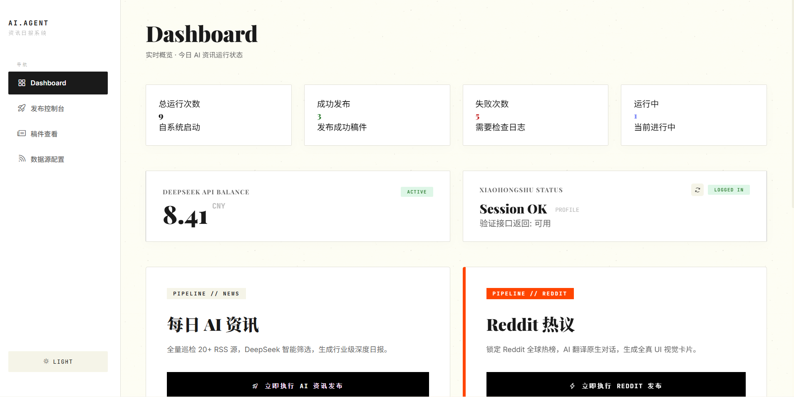
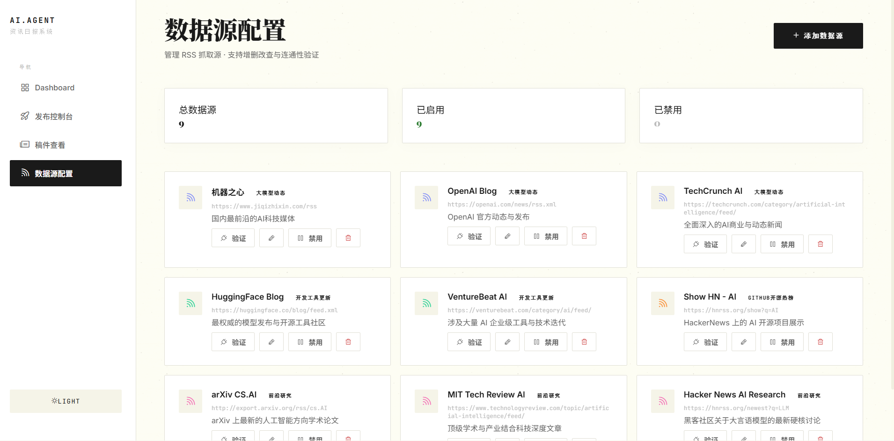
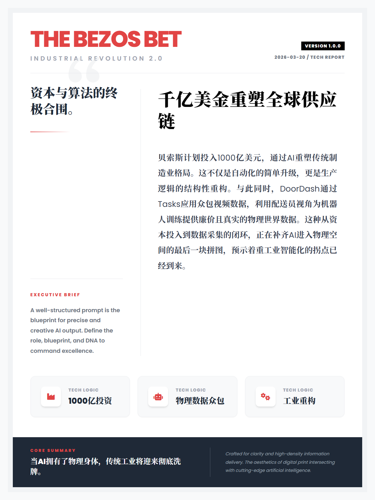
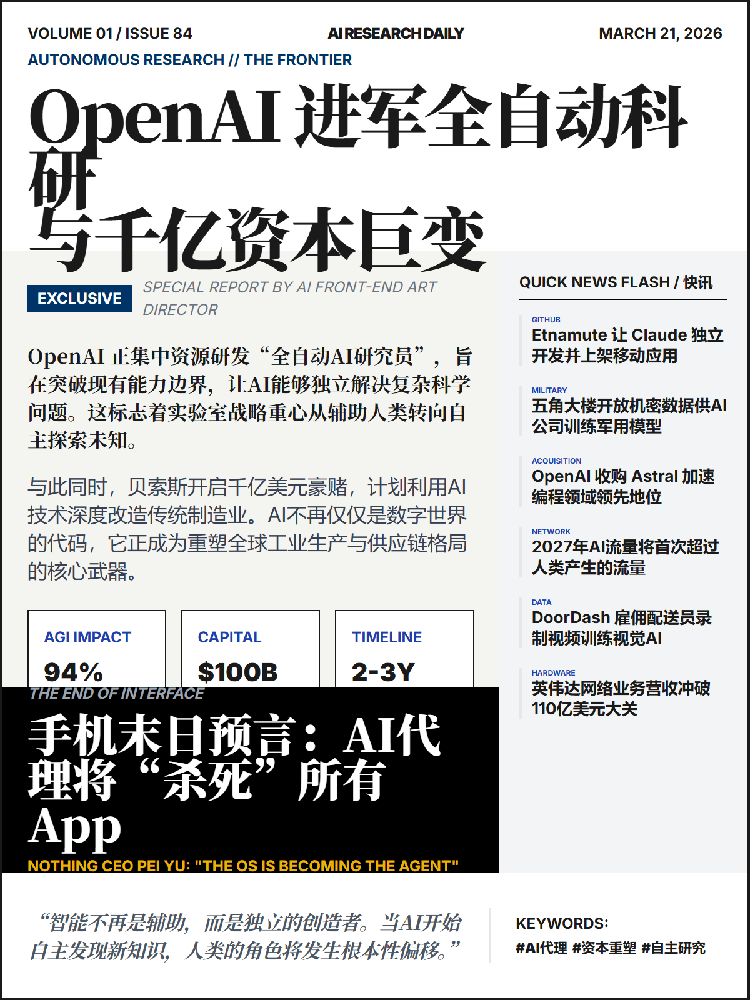

# 🚀 Msgcast: AI-Daily & Reddit Insight Agent
> **全链条内容生产引擎：从海量 RSS 聚合到小红书精美图文一键发布**

[](https://www.python.org/)
[](https://github.com/langchain-ai/langgraph)
[](https://www.deepseek.com/)
[](https://deepmind.google/technologies/gemini/)
[](https://modelcontextprotocol.io/)

---

## 🌟 项目简介

**Msgcast** 是一款专为内容创作者打造的 AI 智能体系统。它通过双工作流并行模式，实时捕获、垂直筛选、并自动生产极具视觉美感的日报卡片，实现“阅读-筛选-排版-发布”的零人工参与全自动化闭环。

### 📌 核心应用场景
- **AI 资讯全量巡检**：全网 20+ RSS 源自动嗅探，智能评分筛选精品。
- **Reddit 深度挖掘**：捕捉全球最热议的话题与深度评论，进行双语结构化提炼。
- **视觉社交传播**：基于智能布局（Generative UI）与海报渲染，一键投送至小红书等平台。

---

## 🛠️ 双核驱动工作流

### 1. AI 资讯日报流 (RSS → 智能筛选 → 自动汇总)
专注行业硬核资讯，通过 `Map-Reduce` 机制生成的结构化日报。


### 2. Reddit 热议流 (RSS 嗅探 → AI 精选 → 双语摘要)
捕捉全球热点脉络，生成包含“金句评论”的双语精选卡片。


---

## 🔥 功能亮点

- **⚡ 极速引擎**: 支持并行工作流模式，互不干扰。
- **🤖 智能过滤**: 深度集成 DeepSeek 高效评分，智能筛除低质、广告资讯。
- **✨ 动态生成 (Generative UI)**: 突破传统模板局限，根据内容实时通过 Gemini 绘制最具设计感的 HTML 布局。
- **📦 工业级发布**: 搭载高性能 MCP (Model Context Protocol) 协议，完美解决跨端（Windows）自动发布难题。
- **📊 监控大盘**: 完善的后端管理面板，实时追踪任务进度、调度状态与 API 额度。

---

## 🖥️ 后台管理系统 (Dashboard)

我们提供了一个美观且直观的后台，方便您轻松配置资源与管理任务。

| 📊 系统汇总视图 | ⚙️ 数据源精细化配置 |
| :---: | :---: |
|  |  |
| *实时概览昨日/今日运行次数与状态* | *支持 RSS、订阅链接的批量管理与在线校验* |

---

## 📂 项目结构

```text
├── src/                    # 核心 Node 节点及工作流逻辑
├── backend/                # FastAPI 后端接口实现
├── frontend/               # 简约、高科技感的 Vue/HTML 管理前端
├── xiaohongshu-mcp/        # MCP 自动发布 Windows 原生驱动
├── templates/              # 各类精美卡片 HTML/Jinja2 模板
└── docs/                   # 相关截图及开发文档
```

---

## 🚀 快速开始

### 1. 环境准备
```bash
python -m venv .venv
source .venv/bin/activate  # Windows: .venv\Scripts\activate
pip install -r requirements.txt
python -m playwright install
```

### 2. 配置环境变量
在项目根目录创建 `.env`，填入您的 API 密钥：
```env
# 核心秘钥 (DeepSeek / Google)
DEEPSEEK_API_KEY=your_key
GOOGLE_API_KEY=your_key

# 代理配置 (如需科学上网)
HTTP_PROXY=http://127.0.0.1:7897
HTTPS_PROXY=http://127.0.0.1:7897
```

### 3. 一键启动
- **后台服务**: `python backend/main.py` (默认 127.0.0.1:8000)
- **手动运行工作流**: `python run_flow_no_publish.py`

---

## 📖 配置参数说明

| 变量 | 作用 | 推荐值 |
| --- | --- | --- |
| `SCORE_THRESHOLD` | 资讯入选分值阈值 | `7` |
| `FETCH_HOURS` | 抓取过去多长时间的新闻 | `24` |
| `XHS_MCP_URL` | 小红书发布组件接口 | `http://127.0.0.1:18060/mcp` |

---

## ✨ 效果展示

### AI 资讯日报样刊
| 封面预览 | 详情展示 |
| :---: | :---: |
|  |  |

### Reddit 热议样刊
| 封面卡片 | 评论卡片 |
| :---: | :---: |
|  |  |

---

© 2024 Msgcast. Powered by LangGraph & DeepSeek.
